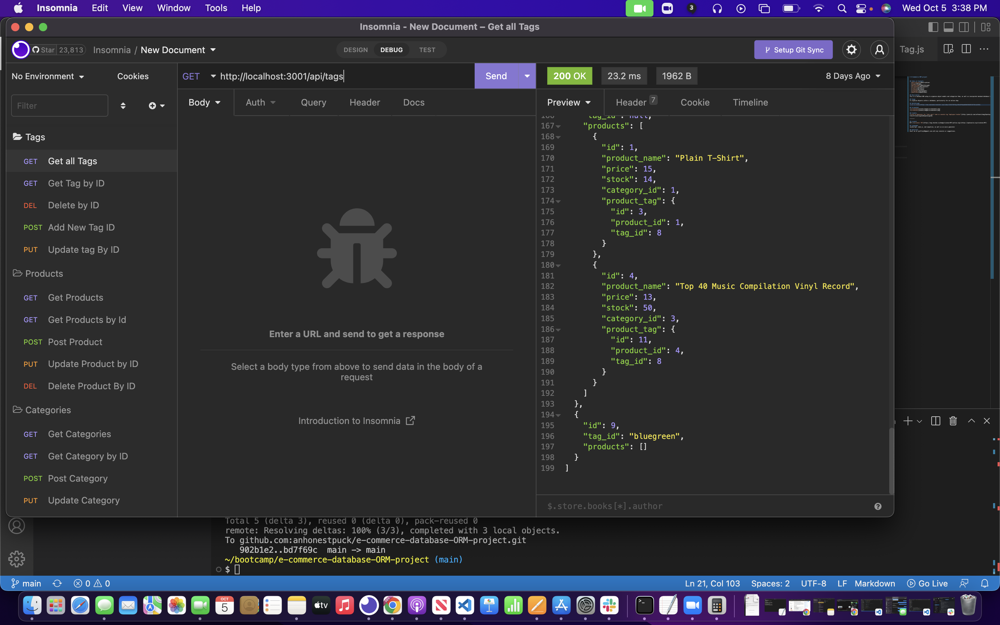

# E-Commmerce ORM project

## Table of Contents
- [Description](#Description)
- [Usage](#Usage)
- [Walkthrough](#Walkthrough)
- [Screenshot](#Screenshot)
- [License](#License)
- [Languages](#Languages)
- [Questions](#Questions)

## Description
This is a backend ORM setup to organize object models and categorize them, as well as incorporate backend database learning.

## Usage
To organize Objects within a database, particularly for an online shop

## Walkthrough
[Link to Video](https://www.awesomescreenshot.com/video/11531726?key=95e18f6eab65b919d261fb719c1e2435)

## Screenshot

-------

## License
MIT 

## Languages
JavaScript, node.js, and sequelize, as well as ORM organization of models and classes

## Questions
Email me at pjeffrey40@gmail.com with any concerns or suggestions.